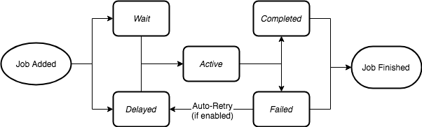

# Project-2-20222
Tiến độ nghiên cứu môn học project 2
Đây là chương trình compiler code đơn giản
## Xây dựng chương trình compiler trên local
Sử dụng thư viện mã nguồn mở codemirror-5.65.12 để xây dựng chương trình compiler trên local<br>
[Codemirror](https://codemirror.net/)<br>
Client sẽ nhận dữ liệu được nhập vào từ người dùng qua phần editor và gửi lên sever dưới dạng chuỗi JSON để xử lý theo phương thức POST<br>
Sau khi nhận được dữ liệu từ client,sever sẽ xử lý dữ liệu bằng thư viện Codemirror và trả về kết quả cho client<br>

Nguồn: [Youtube](https://youtu.be/doS4X0NKnJk)
## Lưu snapshot
Lịch sử các lần compile sẽ được lưu lại tại file temp bằng phương thức endpoint API và xóa các file đã compile trước đó nếu cần thiết<br>

```
app.get("/",function (req,res){ //app.get dùng để lấy dữ liệu từ form
    compiler.flush(function () { //compiler.flush dùng để xóa các file đã compile
        console.log("deleted") //in ra màn hình console
    })
    res.sendFile("G:/Web Project/Simple-Compiler/index.html")//res.sendFile dùng để gửi file index.html
})
```
### Xây dựng hàng đợi 
Xây dựng hàng đợi để xác định thứ tự các lần compile tránh trường hợp nhiều người cùng compile cùng lúc.<br>
Xây dựng hàng đợi bằng thư viện Node Bull dựa trên nền tảng Redis<br>
[Thư viện Bull](https://optimalbits.github.io/bull/)<br>
### Tạo 1 hàng đợi mới<br>
`const myFirstQueue = new Bull('my-first-queue');`<br>
Một hàng đợi thường có 3 vai trò khác nhau : 1 nhà sản xuất công việc,1 người làm việc hoặc/và 1 bộ lắng nghe sự kiện<br>
Producer có thể thêm nhiều công việc vào hàng đợi ngay cả khi không có consumer tại thời điểm đó:Hàng đợi cung cấp giao tiếp không đồng bộ<br>
#### Producers<br>
Có thể thêm công việc vào hàng đợi :<br>
```
const myFirstQueue = new Bull('my-first-queue');

const job = await myFirstQueue.add({
  foo: 'bar'
});
```
<br>
Công việc là 1 javascript object và có thể có bất kỳ thuộc tính nào bạn muốn.Oject này cần phải tuần tự hóa, cụ thể hơn là 1 chuỗi JSON,chính là cách lưu trữ trên Redis <br>

#### Consumers<br>
Là một chương trình Node định nghĩa 1 hàm tiến trình để xử lí công việc<br>

```
const myFirstQueue = new Bull('my-first-queue');

myFirstQueue.process(async (job) => {
  return doSomething(job.data);
});
```
<br>
Tiến trình sẽ luôn được gọi mỗi khi consumer rảnh rỗi và có công việc cần xử lý trong hàng đợi.
Comsumers sẽ không thường xuyên trực tuyến nên có thể có nhiều công việc đang chờ trong hàng đợi,quy trinhg sẽ thực hiện từng công việc 1 cho đến khi hàng đợi rỗng<br>
Giá trị trả về được lưu trữ trong job object và có thể được truy cập sau này<br>
Đôi khi có thể cung cấp tiến độ công việc bên ngoài tiến trình bằng cách gọi job.progress() trong tiến trình<br>

```
myFirstQueue.process( async (job) => {
  let progress = 0;
  for(i = 0; i < 100; i++){
    await doSomething(job.data);
    progress += 10;
    job.progress(progress);
  }
});
``` 
<br>

#### Listeners<br>
Listener có thể lắng nghe cục bộ hoặc toàn cục<br>
Có thể đính kèm 1 trình lắng nghe sự kiện cho 1 hàng đợi<br>
```
const myFirstQueue = new Bull('my-first-queue');

// Define a local completed event
myFirstQueue.on('completed', (job, result) => {
  console.log(`Job completed with result ${result}`);
})
```
#### Job Lifecycle<br>
<br>

<br>
### Events<br>
Sự kiện hoàn thành cục bộ<br>
```
queue.on('completed', job => {
  console.log(`Job with id ${job.id} has been completed`);
})
```
Sự kiện hoàn thành toàn cục<br>
```
queue.on('global:completed', jobId => {
  console.log(`Job with id ${jobId} has been completed`);
})
```
Các sự kiện khác:<br>
[Tài liệu tham khảo](https://github.com/OptimalBits/bull/blob/master/REFERENCE.md#eventsk)
### Queue Options<br>
#### Rate Limiter<br>
Có thể đặt cho hàng đợi số lượng công việc xử lý trên 1 đơn vị thời gian<br>
```
// Limit queue to max 1.000 jobs per 5 seconds.
const myRateLimitedQueue = new Queue('rateLimited', {
  limiter: {
    max: 1000,
    duration: 5000
  }
})
```
Khi đạt đến giới hạn công việc request sẽ tham gia hàng đợi delay<br>
#### Named Jobs<br>
Có thể đặt tên cho các công việc trong hàng đợi giúp hàng đợi rõ ràng trực quan hơn<br>
```
// Jobs producer
const myJob = await transcoderQueue.add('image', { input: 'myimagefile' });
const myJob = await transcoderQueue.add('audio', { input: 'myaudiofile' });
const myJob = await transcoderQueue.add('video', { input: 'myvideofile' });
```
```
// Worker
transcoderQueue.process('image', processImage);
transcoderQueue.process('audio', processAudio);
transcoderQueue.process('video', processVideo);
```
## Tìm hiểu về Redis<br>
### Cài đặt Redis
Cài đặt redis từ [trang chủ](https://github.com/MicrosoftArchive/redis/releases).
Huớng dẫn cài đặt chi tiết tại [đây](https://stackjava.com/redis/huong-dan-cai-dat-redis-server-tren-windows.html).<br>
Hệ thống được sử dựng thông qua cổng: 127.0.0.1:6379<br>
#### Sử dụng redis trong Nodejs thông qua thư viện [node-redis](https://github.com/redis/node-redis#installation)
##### Cài đặt
`npm install redis`<br>
##### Cách sử dụng

### Sử dụng docker để cài đặt redis 
Hướng dẫn cách sử dụng tại [đây](https://topdev.vn/blog/cai-dat-redis-su-dung-docker/).<br>
Sử dụng Docker Desktop và RedisInsight

#### Thêm dữ liệu vào DB
Sử dụng createPool của mysql2/promise để thêm dữ liệu vào DB<br>
Sau đó bắt 2 luồng dữ liệu vào DB<br>
Luồng thứ nhất là input,lấy từ request của client<br>
Luồng thứ 2 là output,lấy từ dữ liệu sau khi biên dịch<br>
