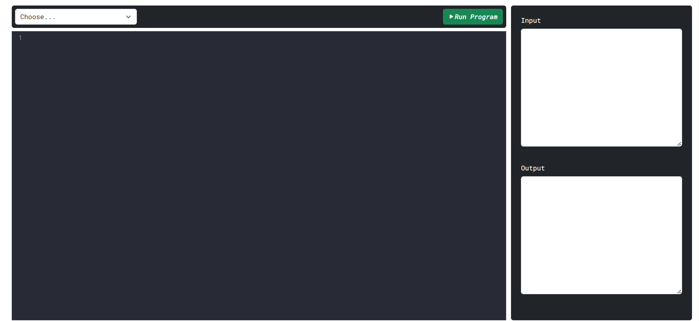

# Project-2-20222
Tiến độ nghiên cứu môn học project 2
Đây là chương trình compiler code đơn giản
## Xây dựng chương trình compiler trên local
Sử dụng thư viện mã nguồn mở codemirror-5.65.12 để xây dựng chương trình compiler trên local<br>
[Codemirror](https://codemirror.net/)<br>
Client sẽ nhận dữ liệu được nhập vào từ người dùng qua phần editor và gửi lên sever dưới dạng chuỗi JSON để xử lý theo phương thức POST<br>
Sau khi nhận được dữ liệu từ client,sever sẽ xử lý dữ liệu bằng thư viện Codemirror và trả về kết quả cho client<br>

Nguồn: [Youtube](https://youtu.be/doS4X0NKnJk)
## Lưu snapshot
Lịch sử các lần compile sẽ được lưu lại tại file temp bằng phương thức endpoint API và xóa các file đã compile trước đó nếu cần thiết<br>

```
app.get("/",function (req,res){ //app.get dùng để lấy dữ liệu từ form
    compiler.flush(function () { //compiler.flush dùng để xóa các file đã compile
        console.log("deleted") //in ra màn hình console
    })
    res.sendFile("G:/Web Project/Simple-Compiler/index.html")//res.sendFile dùng để gửi file index.html
})
```

## Tìm hiểu về Redis<br>
### Cài đặt Redis
Cài đặt redis từ [trang chủ](https://github.com/MicrosoftArchive/redis/releases).
Huớng dẫn cài đặt chi tiết tại [đây](https://stackjava.com/redis/huong-dan-cai-dat-redis-server-tren-windows.html).<br>
Hệ thống được sử dựng thông qua cổng: 127.0.0.1:6379<br>
#### Sử dụng redis trong Nodejs thông qua thư viện [node-redis](https://github.com/redis/node-redis#installation)
##### Cài đặt
`npm install redis`<br>
##### Cách sử dụng

### Sử dụng docker để cài đặt redis 
Hướng dẫn cách sử dụng tại [đây](https://topdev.vn/blog/cai-dat-redis-su-dung-docker/).<br>
Sử dụng Docker Desktop và RedisInsight

#### Thêm dữ liệu vào DB
Sử dụng createPool của mysql2/promise để thêm dữ liệu vào DB<br>
Sau đó bắt 2 luồng dữ liệu vào DB<br>
Luồng thứ nhất là input,lấy từ request của client<br>
Luồng thứ 2 là output,lấy từ dữ liệu sau khi biên dịch<br>

#### Tạo trang đăng nhập
Tạo giao diện đăng nhập,2 trường nhập là username và password<br>
Phân luồng đăng nhập khác nhau giữa admin và user<br>
Phân chia chứa năng của admin là thêm dữ liệu bài tập (soon:xem danh sách user)<br>
Chức năng người dùng là xem danh sách bài tập và nộp bài tập<br>
Sẽ hiện kết quả của từng bài tập và có trình biên dịch hỗ trợ


## Demo chương trình
### Login,Singup
<br>
<br>
### Admin
<br>
<br>
<br>
<br>
<br>
### User
<br>
<br>
<br>
<br>
<br>
<br>
